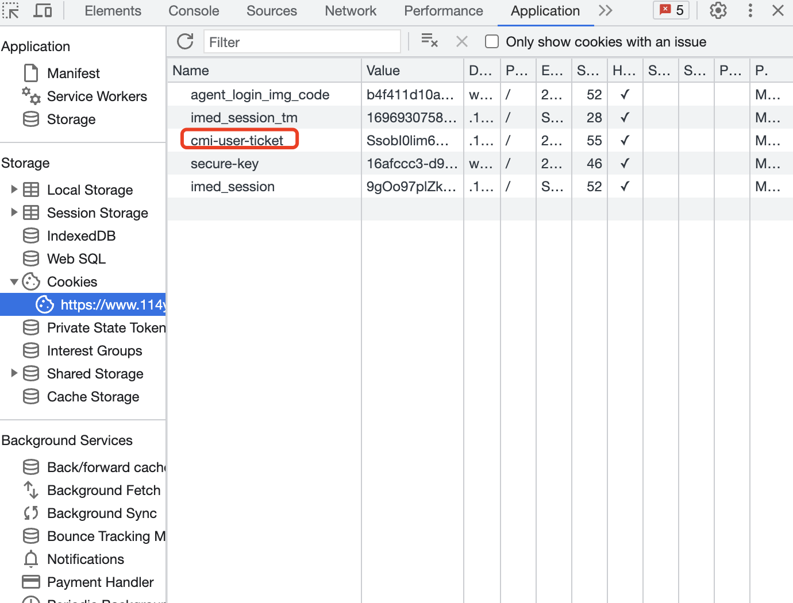
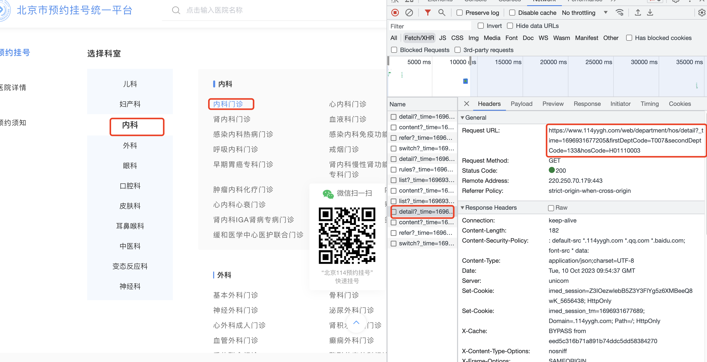

# 北京市114预约挂号脚本

**声明: 本软件只是方便大家挂号，请勿用于非法用途，否则后果自负**

## 环境
- Python3

## 使用方法

1. 安装依赖库，例如：``` pip install --user -r requirements.txt ```
2. 在114使用微信扫码或验证码登录，https://www.114yygh.com/ （因技术有限需登录后手动获取cookie）
3. 修改配置文件
4. 运行命令：
     ```python main.py```

## 配置文件

-  `config.yaml`
-  配置参数说明
   - `cmi-user-ticket`:登录后获取的cookie
   
   - `date`:要挂号的日期，填latest表示抢放号最新一天的号
   - `hospitalId`:医院ID
   - `firstDeptCode`:一级科室ID
   - `secondDeptCode`:二级科室ID
   
   - 以`协和医院-内科-内科门诊`为例，`hospitalId=H01110003，firstDeptCode=T007，secondDeptCode=133`

## Thanks
- 感谢大佬[AndyXiaoyu](https://github.com/AndyXiaoyu/beijingguahao)的开源仓库，本项目据此修改完成